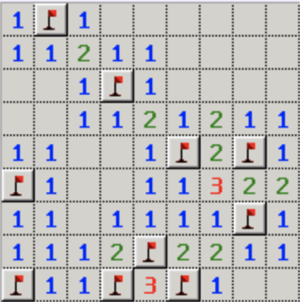

# Minesweeper

## Rules

- Game goal is to find/mark all mines
- When a square is clicked reveal if its a mine or reveal all bordering squares with the number adjacent mines
- When a square not bordering a mine is clicked reveal all bordering empty and bordering mine squares
- Let users mark squares they think have a mine

## Running

- clone the repository
- npm install
- npm start
- view at http://localhost:8080/

All game code can be found in the public directory. i.e. `game.js` `game.html` `game.css`
